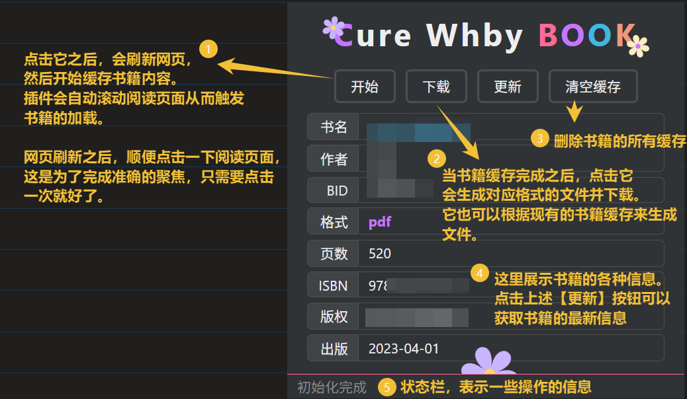

<h1 style="text-align: center; color: #FE5B9B;">Cure Whby Book</h1>

买了魔法书，居然需要特定的魔法才能打开？看我操作！

>   公主：`╰（‵□′）╯` 我写的魔法书你也想白嫖？！
>
>   我：桀桀桀，我可是习得黑魔法的魔法少女！哼哼~认真起来比勇者还可怕！`\(￣︶￣*\))`
>
>   公主：呵！那你知道我认真起来有多可怕？ `┗|｀O′|┛`
>

---

本项目是一个 `Edge/Chrome` 插件，用于在网页端中下载 `武海笔院` 的书籍并保存为 `pdf、epub` 格式。

>   公主：‘武海笔院’ 是什么地方？没听说过呀 `(⊙_⊙)？`
>
>   我：不能说出其真名，只能看谁有缘了 `(￣▽￣)"`，你要是想知道的话，靠近点，再近点！我偷偷告诉你哟 :)

# Tip

只能在网页端下载书籍，不支持转换其自定义的书籍格式。

只能下载能看到的书籍内容 —— 如果没有购买书籍，那么只能下载书籍试看的部分。

书籍有两种阅读模式，对应不同的下载格式：

-   原貌阅读模式：下载的是以图片拼接而成的 `PDF`，**无法复制内部文字**。在网站中阅读时能复制文字，是因为网页会捕获鼠标框选的区域，在服务器获取对应位置的文字内容再返回
-   流式阅读模式：下载的是 `epub`，符合 `epub3` 规范，**可以复制内部文字**，但不是所有书籍都具备该阅读模式 —— 在书籍详情页面查看该书籍的封面，如果右下角有一个“原貌”的图标，就说明该书籍支持流式阅读模式

---

**账号的安全是最重要的**，所以：

-   *没有直接访问接口来获取书籍内容*（虽然该方案的书籍下载速度非常快），但是直接访问接口获取书籍的信息与目录
-   没有重写 `XHR` 等网页中的任何 Web API
-   没有修改网站的 `DOM` 结构，添加任何 UI 
-   仅通过插件拦截响应来下载书籍

具体来说，使用以下方式尽可能保证账号安全：

-   利用浏览器插件拦截并读取网页的请求与响应，从而分析、下载书籍的每一页内容，和网页环境隔离
-   为了能加载书籍的内容，需要操作阅读页面来触发加载，可以使用插件的自动翻页功能。为了模拟是真人在阅读，插件的自动化具体有以下措施：
    -   使用 `Chrome Devtools Protocol` 操作浏览器翻页
    -   翻页时仅仅是触发了一次完整的 `ArrowDown`（向下方向键）按键
    -   原貌阅读模式中，每次向下滑动的距离很短，和平时按方向键翻页时那样
    -   流式阅读模式中，每次翻一页，和平时按方向键翻页时那样
    -   每次触发按键的间隔是 `3 秒`
-   我不清楚下载的书籍中是否有隐藏的水印，如果想分享给他人，请注意其中风险
-   短时间下载多本书籍可能被发现哟，毕竟不是谁都像我一样【下载魔法书就立即学会】，所以一天看十本书太不正常啦
-   **每次只能下载一本书籍，不能同时下载多本书籍**，毕竟就连我都做不到同时读两本书，端水大师也做不到！（咳，其实我认真起来也不是不行）

>   公主：啧~唧唧歪歪，花里胡哨！说不定别人已经把你记上小本本了 `(* ￣︿￣)`
>
>   我：o_o！？

# Tutorial

插件只在**书籍的阅读页面**才会启用，在其它页面中会显示成灰色图标，且无法使用。

在书籍阅读页面点击插件后，会展示该书籍的基础信息，它们将作为书籍的元信息写入到最终生成的文件中。

现在插件已经可以完整的下载 `pdf、epub` 文件了，一些小问题还在慢慢解决中。

-   在原貌阅读模式（pdf）下，点击开始按钮之后，需要手动点击鼠标，聚焦到页面中
-   在流失阅读模式（epub）下，需要调整样式，修改其布局为双栏

# Warning

本项目人工编写。古法传承，匠心巨作，悉心打磨，传世经典。

>   公主：居然没有使用那个什么 AI？？
>
>   我：心爱的东西当然得亲手做，上次送你的礼物也是亲手做的哟 `§(*￣▽￣*)§`
>
>   公主：欸~原来如此，额...以后你送别人礼物时，还是买比较好 >_<

# Attribution

[Extension Icon](https://www.flaticon.com/free-icon/fairytale_5319040?related_id=5318)
